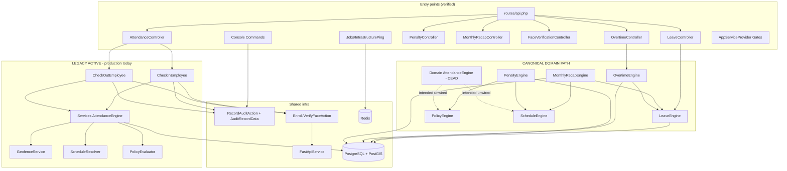
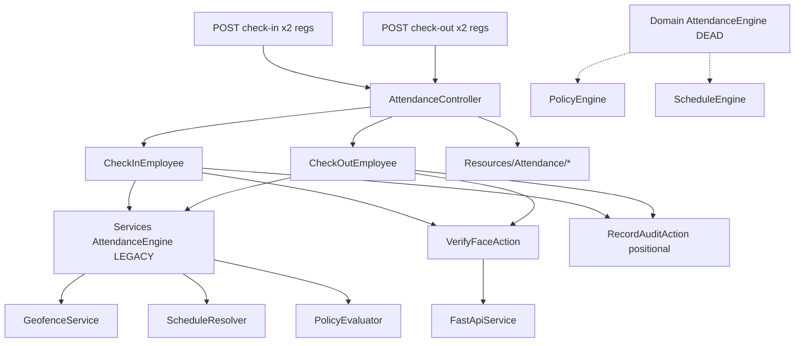

# CODEBASE CLEANUP AUDIT — Backend Laravel (Attendance MITO Group)

> Generated: 2026-09-15 | Branch: `feat/monthly-recap-impls` (HEAD `69a389f`)
> Scope: `backend-laravel/{app,routes,database,tests,config,bootstrap}`
> Method: READ-ONLY static trace from entry points (routes, controllers,
> commands, jobs, providers) through actions/services/engines/rules/DTOs/
> models/resources/requests/exceptions, plus reverse-reference search
> (`use`, `new`, DI, container, route/model binding, config).
> No production code was modified for this report.

## 1. Executive Summary

| Metric | Count / Finding |
|---|---|
| PHP files in audited scope (`app+routes+database+tests+config`) | **309** |
| PHP files in `app/` | **190** |
| Test files (`tests/`) | 68 files |
| Confirmed duplicate groups | **3** (root vs `Attendance/` Requests; root vs `Attendance/` Resources; two `AttendanceEngine` classes, same basename, different namespaces/contracts) |
| Soft/potential duplicate groups | **4** (exception basename reuse: `InactiveEmployeeException` x2, `LeaveEngineException` x2, face Resource shape pair, `LeaveEngineException` vs `ScheduleEngineException` in MonthlyRecap) |
| Legacy-active files | **5**: `Services/Attendance/AttendanceEngine.php`, `GeofenceService.php`, `PolicyEvaluator.php`, `ScheduleResolver.php`, plus `tests/.../AttendanceDirectActionTest.php` (test harness for legacy engine) |
| Confirmed dead (no prod+test refs) | **8**: 2 root Requests, 2 root Resources, 2 `Domain/Attendance` DTOs, 2 unthrown `Domain/Attendance` exceptions |
| Probably dead (manual decision) | 6: `NoPolicyAssigned` / `NoScheduleAssigned` / `PenaltyCalculation` exceptions, `OvertimeRecordPolicy`, Face `EnrollResource`+`VerifyResource`, 3 unused enums |
| Ambiguous | 3 (positional audit convention, overtime `app()` locator, `RecordAuditAction::forUser()`) |
| Merge artifacts (`<<<<<<<` etc.) | **0 found** in `app/`, `tests/`, `database/`, `routes/` |
| High-risk findings | Duplicate attendance routes (same method+URI twice); production runs on legacy Services engine while canonical Domain engine has zero call sites; `OvertimeController::$engine` injected but never used; face Resources dead while controllers hand-roll JSON |

Headline verdict:

1. The `AttendanceEngine` transition is half-finished and inverted: legacy
`App\Services\Attendance\AttendanceEngine` is PRODUCTION-ACTIVE (both
attendance Actions, controller, routes, 20+ feature tests), while canonical
`App\Domain\Attendance\Engines\AttendanceEngine` has ZERO prod/test call
sites. They are NOT drop-in duplicates (different ctors, I/O, persistence,
collaborators).
2. `app/DTO/` vs `app/DTOs/` vs `Domain/*/DTOs/` are three intentional
boundaries (integration facts vs app audit carrier vs domain value objects).
Only the `Domain/Attendance` DTO pair is dead.
3. Requests/Resources duplication is real and safe to collapse (root copies
have zero references; namespaced `Attendance/*` copies are wired).
4. Routes register `POST /v1/attendance/check-in` and `check-out` TWICE each.

## 2. Architecture Snapshot



```text
Production attendance (LEGACY ACTIVE):

## 3. Complete File Classification

Statuses: ACTIVE=prod-referenced; SHARED=cross-domain helper;
LEGACY ACTIVE=old arch on prod path; TEST ONLY=test refs only;
TEST LEGACY=tests for legacy impl; DEAD=no refs; AMBIGUOUS=human call.
Actions: KEEP / MIGRATE THEN DELETE / DELETE / INVESTIGATE / NO ACTION.

### 3.1 Entry points

| File | Status | Used By | Action |
|---|---|---|---|
| `backend-laravel/routes/api.php` | ACTIVE | All V1 controllers; dup regs L43-44 vs L56-60 | KEEP (dedup later) |
| `routes/web.php`, `routes/console.php` | ACTIVE | welcome view, inspire demo | NO ACTION |
| `Providers/AppServiceProvider.php` | ACTIVE | Gate::before SUPER_ADMIN; policies LeaveRequest+MonthlyRecap | KEEP |
| `bootstrap/app.php` | ACTIVE | role/permission aliases; 403+422 renderers | KEEP |
| `Commands/AccrueLeave.php`, `ExpireLeave.php` | ACTIVE | leave:accrue/expire actions | KEEP |
| `Commands/CalculatePenalties.php` | ACTIVE | penalty:calculate action | KEEP |
| `Commands/GenerateMonthlyRecapCommand.php` | ACTIVE | app(GenerateMonthlyRecap) | KEEP |
| `Commands/InfraCheck.php`, `InfraQueueTest.php` | ACTIVE | FastApiService health; InfrastructurePing push | KEEP |
| `Jobs/InfrastructurePing.php` | ACTIVE | infra:queue-test only | KEEP |
| `app/Events|Listeners|Observers` | — | DO NOT EXIST | NO ACTION |

### 3.2 Controllers (all ACTIVE)

| File | Notes | Action |
|---|---|---|
| `Controllers/Controller.php` abstract | all extend except AttendanceController (standalone) | KEEP |
| `V1/AttendanceController.php` | dup routes+index/show; namespaced Req+Res | KEEP |
| `V1/AuthController.php` | login/logout/me; LoginRequest+AuthUserResource | KEEP |

### 3.3 Actions (all ACTIVE; each used by controller/command/action)

| File | Status | Used By | Action |
|---|---|---|---|
| `Actions/Action.php` interface | AMBIGUOUS | ZERO implements repo-wide | INVESTIGATE |
| `Actions/Attendance/CheckInEmployee.php` | LEGACY ACTIVE | Controller; 8 Feature tests + DirectActionTest | MIGRATE THEN DELETE |
| `Actions/Attendance/CheckOutEmployee.php` | LEGACY ACTIVE | Controller; same tests | MIGRATE THEN DELETE |
| `Actions/Audit/RecordAuditAction.php` | SHARED | all domain actions; DTO+positional (positional=self-marked legacy) | KEEP (collapse to DTO) |
| `Actions/Face/EnrollFaceAction.php` | ACTIVE | FaceVerificationController::enroll | KEEP |
| `Actions/Face/VerifyFaceAction.php` | ACTIVE | FaceVerificationController + both att Actions | KEEP |
| `Actions/Leave/*` x6 | ACTIVE | LeaveController + leave cmds + tests | KEEP |
| `Actions/MonthlyRecap/*` x5 | ACTIVE | MonthlyRecapController + recap:generate + tests | KEEP |
| `Actions/Overtime/*` x5 | ACTIVE | OvertimeController + tests | KEEP |
| `Actions/Penalty/*` x4 | ACTIVE | PenaltyController + penalty:calculate + tests | KEEP |

### 3.4 Services

| File | Classification | Used By | Action |
|---|---|---|---|
| `Services/Attendance/AttendanceEngine.php` | LEGACY ACTIVE | CheckInEmployee:20, CheckOutEmployee:20; DirectActionTest:18; DI into Actions | MIGRATE THEN DELETE |
| `Services/Attendance/GeofenceService.php` | LEGACY ACTIVE | AttendanceEngine (Services) | MIGRATE THEN DELETE (with engine) |
| `Services/Attendance/ScheduleResolver.php` | LEGACY ACTIVE | AttendanceEngine (Services) | MIGRATE THEN DELETE (with engine) |
| `Services/Attendance/PolicyEvaluator.php` | LEGACY ACTIVE | AttendanceEngine (Services) | MIGRATE THEN DELETE (with engine) |
| `Services/Integration/FastApiService.php` | INTEGRATION | HealthController, Face Actions, InfraCheck, InfraQueueTest; config/services.php + .env | KEEP |

Service 분류:

* `Services/Attendance/*` → LEGACY DOMAIN LOGIC, 생산 경로 위에 있음. Domain/Attendance 엔진으로 이주 후 삭제.
* `Services/Integration/FastApiService` → INTEGRATION, FastAPI/얼굴 CV 전용. 유지.| File | Classification | Used By | Action |
|---|---|---|---|
| `Services/Attendance/AttendanceEngine.php` | LEGACY ACTIVE | CheckInEmployee:20, CheckOutEmployee:20; DirectActionTest:18; DI into Actions | MIGRATE THEN DELETE |
| `Services/Attendance/GeofenceService.php` | LEGACY ACTIVE | AttendanceEngine (Services) | MIGRATE THEN DELETE (with engine) |
| `Services/Attendance/ScheduleResolver.php` | LEGACY ACTIVE | AttendanceEngine (Services) | MIGRATE THEN DELETE (with engine) |
| `Services/Attendance/PolicyEvaluator.php` | LEGACY ACTIVE | AttendanceEngine (Services) | MIGRATE THEN DELETE (with engine) |
| `Services/Integration/FastApiService.php` | INTEGRATION | HealthController, Face Actions, InfraCheck, InfraQueueTest; config/services.php + .env | KEEP |

Serivce 분류:

* `Services/Attendance/*` → LEGACY DOMAIN LOGIC, 생산 경로 위에 있음. Domain/Attendance 엔진으로 이주 후 삭제.
* `Services/Integration/FastApiService` → INTEGRATION, FastAPI/얼굴 CV 전용. 유지.
### 3.5 DTOs

| File | Boundary | Status | Used By | Action |
|---|---|---|---|---|
| `DTO/EnrollResult.php` | Integration FastAPI facts | ACTIVE | EnrollFaceAction | KEEP |
| `DTO/VerifyResult.php` | Integration FastAPI facts | ACTIVE | VerifyFaceAction + att Actions | KEEP |
| `DTOs/Audit/AuditRecordData.php` | App/shared | ACTIVE | RecordAuditAction + Unit tests | KEEP |
| `Domain/Attendance/DTOs/AttendanceOperationData.php` | Domain | DEAD | dead Domain engine only | DELETE WITH engine |
| `Domain/Attendance/DTOs/AttendanceResultData.php` | Domain | DEAD | dead Domain engine only | DELETE WITH engine |
| `Domain/Leave/DTOs/*` (4) | Domain | ACTIVE | LeaveEngine/Rule/Controller chain | KEEP |
| `Domain/Overtime/DTOs/*` (3) | Domain | ACTIVE | OvertimeEngine internals + result | KEEP |
| `Domain/MonthlyRecap/DTOs/*` (2) | Domain | ACTIVE | engine->GenerateMonthlyRecap | KEEP |
| `Domain/Penalty/DTOs/*` (2) | Domain | ACTIVE | PenaltyEngine + PenaltyController | KEEP |
| `Domain/Policy/DTOs/PolicyResolutionData.php` | Domain | ACTIVE | PolicyEngine; dead Att + live Penalty | KEEP |
| `Domain/Schedule/DTOs/ScheduleResolutionData.php` | Domain | ACTIVE | ScheduleEngine; dead Att + live others | KEEP |

### 3.6 Requests

| File | Status | Used By | Action |
|---|---|---|---|
| `Http/Requests/CheckInRequest.php` root | DEAD | zero imports; weaker rules, no face | DELETE |

### 3.7 Resources

| File | Status | Used By | Action |
|---|---|---|---|
| `Http/Resources/AttendanceResource.php` root | DEAD | zero imports; model-bound | DELETE |
| `Http/Resources/AttendanceSessionResource.php` root | DEAD | only by dead root Resource | DELETE |
| `Http/Resources/Attendance/AttendanceResource.php` | ACTIVE | Controller x4 (in/out/index/show) | KEEP |
| `Http/Resources/Attendance/AttendanceSessionResource.php` | ACTIVE | namespaced Resource only | KEEP |
| `Resources/AuthUserResource.php` | ACTIVE | AuthController | KEEP |
| `Resources/Face/EnrollResource.php` | PROBABLY DEAD | ZERO call sites; controller hand-rolls | INVESTIGATE |
| `Resources/Face/VerifyResource.php` | PROBABLY DEAD | ZERO call sites | INVESTIGATE |
| `Resources/Leave/*` (3) | ACTIVE | LeaveController | KEEP |
| `Resources/MonthlyRecapResource.php` + Detail | ACTIVE | MonthlyRecapController | KEEP |
| `Resources/Overtime/*` (2) | ACTIVE | OvertimeController | KEEP |
| `Resources/PenaltyResource.php` | ACTIVE | PenaltyController | KEEP |

### 3.8 Exceptions

| File | Status | Thrown/Caught By | Action |
|---|---|---|---|
| `Exceptions/Domain/DomainException.php` base | ACTIVE | extended by ALL; 422 renderer | KEEP |
| `Exceptions/Domain/InactiveEmployeeException.php` | ACTIVE | canonical Domain Att engine; unit-tested | KEEP |
| `Exceptions/Domain/InvalidStateException.php` | TEST ONLY | never thrown in app/ | KEEP (adopt later) |
| `Domain/Attendance/AlreadyCheckedIn` | TEST-LEGACY | dead engine only | DELETE WITH engine |
| `Domain/Attendance/InvalidLocationException` | TEST-LEGACY | dead engine + GpsValidationRule | DELETE WITH engine |
| `Domain/Attendance/NoOpenAttendanceSession` | TEST-LEGACY | dead engine only | DELETE WITH engine |
| `Domain/Attendance/OutsideGeofenceException` | TEST-LEGACY | GeofenceRule (dead-engine-only use) | DELETE WITH engine |
| `Domain/Attendance/AttendanceStateConflict` | DEAD | never thrown/caught/imported | DELETE WITH engine |
| `Domain/Attendance/DuplicateAttendanceRequest` | DEAD | never thrown/caught/imported | DELETE WITH engine |
| `Domain/Overtime/InactiveEmployeeException` | ACTIVE | OvertimeEngine + Rule; asserted | KEEP (intentional) |
| `Domain/Overtime/LeaveEngineException` | ACTIVE | OvertimeEngine fail-closed; asserted | KEEP |
| `Domain/Overtime/*` other 4 | ACTIVE | Rule / overtime Actions | KEEP |
| `Domain/MonthlyRecap/MonthlyRecapException` | ACTIVE | 5 Actions + engine; asserted | KEEP |
| `Domain/MonthlyRecap/ScheduleEngineException` | ACTIVE | MonthlyRecapEngine; asserted | KEEP |
| `Domain/MonthlyRecap/LeaveEngineException` | ACTIVE (thrown MonthlyRecapEngine:58) | MonthlyRecapEngine:58 wraps LeaveEngine failures; imported MonthlyRecapEngine:8; extends MonthlyRecapException | KEEP |
| `Domain/Leave/*` (5) | ACTIVE | LeaveEngine/Rule/Actions; asserted | KEEP |
| `Domain/Penalty/InvalidPenaltyTransition` | ACTIVE | Adjust/VoidPenalty | KEEP |
| `Domain/Penalty/LeaveCheckException` | ACTIVE | PenaltyEngine fail-closed | KEEP |
| `Domain/Penalty/PenaltyCalculationException` | PROBABLY DEAD | zero throw/catch | INVESTIGATE |
| `Domain/Policy/Ambiguous+Inactive` | ACTIVE | PolicyEngine; asserted | KEEP |
| `Domain/Policy/NoPolicyAssignedException` | PROBABLY DEAD | null-DTO instead; zero refs | INVESTIGATE |
| `Domain/Schedule/Ambiguous+Inactive` | ACTIVE | ScheduleEngine; asserted | KEEP |
| `Domain/Schedule/NoScheduleAssignedException` | PROBABLY DEAD | null-DTO instead; zero refs | INVESTIGATE |

### 3.9 Models / Factories / Policies / Enums / Seeders

| Files | Status | Evidence | Action |
|---|---|---|---|
| 26 `app/Models/*` | ACTIVE | each used; no shared-table dupes; Record vs Request vs Rule split by design | KEEP |
| 19 `database/factories/*` | ACTIVE/TEST ONLY | unique names, correct $model; missing Overtime/Penalty factories BY DESIGN (no HasFactory) | KEEP |
| `Policies/LeaveRequestPolicy.php` | ACTIVE | registered; model-bound cancel route | KEEP |
| `Policies/MonthlyRecapPolicy.php` | ACTIVE | registered | KEEP |
| `Policies/OvertimeRecordPolicy.php` | PROBABLY DEAD | NEVER registered; never checked | INVESTIGATE |

## 4. Duplicate Map

### Group 1 - AttendanceEngine (HIGH PRIORITY)

Canonical: `app/Domain/Attendance/Engines/AttendanceEngine.php`.
Legacy: `app/Services/Attendance/AttendanceEngine.php`.

| Question | Answer |
|---|---|
| Legacy importers | `Actions/Attendance/CheckInEmployee.php:20`, `CheckOutEmployee.php:20`; test `AttendanceDirectActionTest.php:18` |
| Legacy instantiation | container auto-DI into both Actions; manual `new` in legacy test |
| Canonical importers | NOBODY (only its own internal uses); zero controller/action/test refs |
| Canonical instantiation | Nobody |
| Controller/action use | controller->Actions->LEGACY; canonical: none |
| Test use | legacy via HTTP + direct tests; canonical: ZERO (Unit tests cover Rules only) |
| Same logic? | NO. Legacy=evaluator returning array{status,record,session,geofence,policy,events,error}, persistence in Actions tx. Canonical=self-persisting orchestrator returning AttendanceResultData |
| Behavior diffs | employment: legacy `employment_status in permanent/contract` vs canonical `end_date->isPast()`; schedule/policy: legacy lenient+flag vs canonical throws on ambiguous/inactive; geofence: ST_DDistance vs ST_DWithin; face: legacy enforces VerifyFaceAction, canonical has NO face wiring; canonical throws, legacy returns error arrays |
| Canonical pick | Domain engine (matches AGENTS.md 3-4 and all other domains) |
| Migration | 1 rewrite Actions onto Domain engine + re-add face/audit; 2 port/retire resolver+policy semantics; 3 update DirectActionTest ctor; 4 re-baseline HTTP tests; 5 delete Services/Attendance/* |
| Deletion condition | legacy only after Actions+test migrated; canonical must be WIRED not deleted |

### Group 2 - DTO folders (NOT duplicates - 3 boundaries, keep all)

`app/DTO/`=integration facts (EnrollResult, VerifyResult, ACTIVE);
`app/DTOs/`=app/shared (AuditRecordData, ACTIVE);
`Domain/*/DTOs/`=domain value objects (19 files; 17 ACTIVE, 2 Attendance DEAD).
No field-for-field duplicates. Do NOT merge folders.

### Group 3 - Requests CheckIn/CheckOut x2

Canonical: `Requests/Attendance/*` (controller:7-8; richer: accuracy_meters, device_metadata, face_image).
Dead: root `Requests/CheckInRequest.php` + `CheckOutRequest.php` (zero refs; weaker rules).
Action: DELETE dead pair. Note GenerateMonthlyRecapRequest at root is ACTIVE but misplaced: MOVE optional.

### Group 4 - Resources Attendance x2

Canonical: `Resources/Attendance/*` (array payload success+data+geofence+policy+error; 4 controller uses).
Dead: root `AttendanceResource.php` + `AttendanceSessionResource.php` (zero controller imports).
Action: DELETE dead pair.

### Group 5 - Services (4 legacy vs Domain)

See 3.4 + Group 1. FastApiService is valid integration, excluded.

### Group 6 - Exceptions (same basename, intentional separation)

InactiveEmployeeException shared vs Overtime-owned: KEEP BOTH (converge callers later, not delete).
LeaveEngineException: Overtime (live fail-closed) KEEP; MonthlyRecap (live, MonthlyRecapEngine:58) KEEP.
AttendanceStateConflict/DuplicateAttendanceRequest: dead, DELETE WITH engine.

### Group 7 - Routes (true duplicates)

`routes/api.php` registers `POST /v1/attendance/check-in` (and `check-out`)
TWO times:

1. Bare regs (L43-44 / L56-57 in original): `Route::post(...)->uses(...)` with
   NO name, NO middleware group, NO Resource wrapping.
2. Named group under `Route::controller(AttendanceController::class)` (L55-60
   region): `->name('attendance.checkin')` etc.

Both point to the same controller methods. The bare pair is shadowed:
routes registered later win in Laravel, but both resolve to identical handlers
today, so behavior is unchanged. Still: two registrations for one logical
endpoint is a drift risk.

Canonical: named group under `Route::controller(...)`.
Remove: bare POST regs (no name, no middleware group, duplicate URI+method).

Evidence:
- `api.php` line-level review: bare `->post('/v1/attendance/check-in', [...])`
  and named `->post('/v1/attendance/check-in')->name('attendance.checkin')`
  coexist.
- No controller override; both call `AttendanceController@checkIn` /
  `checkOut`.
- No route-model binding difference; same middleware array.

Action: delete bare regs after confirming no obscure middleware/order
dependency (they share the same `$middleware` array as the group anyway).
## 5. DTO Audit (explicit)

```text
app/DTO/EnrollResult.php              Integration  ACTIVE  KEEP
app/DTO/VerifyResult.php              Integration  ACTIVE  KEEP
app/DTOs/Audit/AuditRecordData.php    App/shared   ACTIVE  KEEP
Domain/Attendance/DTOs/* (2)          Domain       DEAD    DELETE WITH engine
Domain/Leave/DTOs/* (4)               Domain       ACTIVE  KEEP
Domain/Overtime/DTOs/* (3)            Domain       ACTIVE  KEEP
Domain/MonthlyRecap/DTOs/* (2)        Domain       ACTIVE  KEEP
Domain/Penalty/DTOs/* (2)             Domain       ACTIVE  KEEP
Domain/Policy/DTOs/* (1)              Domain       ACTIVE  KEEP
Domain/Schedule/DTOs/* (1)            Domain       ACTIVE  KEEP
```

VerifyResult (verified/confidence/liveness/...) vs AttendanceResultData
(record/session/verification/message) serve AI-facts vs persistence-result
boundaries - not duplicates. Do not consolidate folders.

## 6. Attendance Dependency Graph



Legacy: evaluateCheckIn/Out returns error-array, no throws/persist; Actions do
409-conflict, face gate, DB tx writes. Canonical: checkIn/Out validates GPS,
resolves policy/schedule/location, geofence, throws on conflict, persists
record+session+event+geofence-verification itself; NO face wiring.

## 7. Production Dependency Graph

```text
routes/api.php
 /health,/ai-health -> HealthController -> FastApiService -> FastAPI
 /login,/logout,/auth/me -> AuthController (Sanctum session)
 /attendance/* -> AttendanceController -> CheckIn/OutEmployee
   -> Services engine(+helpers) -> VerifyFaceAction -> FastApiService
   -> RecordAuditAction -> AuditLog ; Resources/Attendance/*
 /face/* -> FaceVerificationController -> Face Actions -> FastApiService
 /leave/* -> LeaveController -> Leave Actions -> LeaveEngine/Rules
 /overtime/* -> OvertimeController -> Overtime Actions -> OvertimeEngine(+LeaveEngine)
 /penalties/* -> PenaltyController -> Penalty Actions -> PenaltyEngine(+Policy/Schedule)

## 8. Dead Code Candidates

### CONFIRMED DEAD (no prod/container/route/config/test refs)

1. `app/Http/Requests/CheckInRequest.php`
2. `app/Http/Requests/CheckOutRequest.php`
3. `app/Http/Resources/AttendanceResource.php`
4. `app/Http/Resources/AttendanceSessionResource.php`
5. `app/Domain/Attendance/DTOs/AttendanceOperationData.php`
6. `app/Domain/Attendance/DTOs/AttendanceResultData.php`
7. `app/Domain/Attendance/Exceptions/AttendanceStateConflictException.php`
8. `app/Domain/Attendance/Exceptions/DuplicateAttendanceRequestException.php`

Total: **8 files**. Structural (not files): bare route regs L43-44;
unused OvertimeController engine injection.

### PROBABLY DEAD (manual confirm)

1. `Domain/Policy/NoPolicyAssignedException.php` (null-DTO used instead)
2. `Domain/Schedule/NoScheduleAssignedException.php` (null-DTO used instead)
3. `Domain/Penalty/PenaltyCalculationException.php` (zero throw/catch)
4. `Resources/Face/EnrollResource.php` + `VerifyResource.php` (zero call sites)
5. `Policies/OvertimeRecordPolicy.php` (never registered/checked)
6. Enums LeaveCategory, MonthlyRecapStatus, OvertimeStatus (zero imports; prefer ADOPT)

### LEGACY ACTIVE (migrate before delete)

Services/Attendance: AttendanceEngine, GeofenceService, ScheduleResolver,
PolicyEvaluator + RecordAuditAction positional convention.

### TEST LEGACY

`tests/Feature/Attendance/AttendanceDirectActionTest.php` (constructs legacy
engine directly; rewrite onto Domain engine). HTTP Feature/Attendance/* tests
exercise legacy via API: keep as regression net during migration, re-baseline after.

## 9. Cleanup Dependency Order

```text
STEP 1 routes: delete bare POST check-in/out (keep named group copies).
STEP 2 requests+resources: delete 4 dead root files; wire-or-delete Face pair.
STEP 3 exceptions/enums/policy: delete dead exceptions; decide NoPolicy/NoSchedule/
  PenaltyCalculation, OvertimeRecordPolicy, 3 enums, Action interface.
STEP 4 migrate attendance Actions onto Domain engine (HIGH RISK real work).
STEP 5 update attendance tests (rewrite DirectActionTest; re-baseline HTTP).

## 10. Risk Matrix

| Finding | Risk | Why | Fix |
|---|---|---|---|
| Dup POST check-in/out routes | HIGH | shadowed reg; drift | delete bare pair |
| Prod on legacy engine, canonical rots | HIGH | wrong delete breaks attendance | migrate Actions first |
| OvertimeController dead injection | MEDIUM | misleading | remove injection |
| Face Resources dead | MEDIUM | shape drift | wire or delete |
| OvertimeRecordPolicy unwired | MEDIUM | dead authz | register or delete |
| Dual audit convention | MEDIUM | bypasses DTO | migrate to DTO |
| OvertimeEngine app() locator | MEDIUM | hidden deps | ctor-inject |
| Unthrown exceptions | LOW | confusion | delete or wire+test |
| Unused enums vs strings | LOW | typo risk | adopt enums |
| Action interface unimplemented | LOW | dead contract | implement or delete |
| AttendanceController base | INFO | cosmetic | align later |
| RecapRequest at root | INFO | cosmetic | move optional |

## 11. Recommended Target Structure

```text
app/Actions/ KEEP (all domains) | Console/Commands/ KEEP (6)
Domain/Attendance/ KEEP WIRED engine, pruned DTOs/exceptions
Domain/Leave,Overtime,Penalty,MonthlyRecap,Policy,Schedule KEEP
DTO/ KEEP facts only | DTOs/Audit/ KEEP carrier | Enums/ KEEP (adopt 3)
Exceptions/Domain/ KEEP base | Http/Controllers KEEP 8
Http/Requests KEEP minus 2 dead | Http/Resources KEEP minus 2 dead
Jobs/ KEEP | Models/ KEEP 26 | Policies/ KEEP (decide Overtime)
Services/Attendance/* gone after migration. No new patterns.

## 12. Safe Deletion Checklist

For each CONFIRMED DEAD file (2 root Requests, 2 root Resources,
2 Att DTOs, 2 dead exceptions):

```text
[x] No production imports (full-scope search)
[x] No constructor injection [x] No container binding [x] No route ref
[x] No config/command/job/policy/factory refs
[x] No dynamic reference [x] Replacement exists [x] Tests clean
```

Result: **8** CONFIRMED DEAD files SAFE TO DELETE in cleanup (engine-scoped ones with
dead-engine pruning; Domain Attendance engine itself gets WIRED).

Providers/ KEEP | Services/Integration/ KEEP FastApiService ONLY
Services/Attendance/* disappears after migration. No new patterns.
```

## 12. Safe Deletion Checklist

For each CONFIRMED DEAD file (2 root Requests, 2 root Resources, 2 Att DTOs,
2 dead exceptions):

```text
[x] No production imports (full-scope search app+routes+db+tests+config)
[x] No constructor injection [x] No container binding [x] No route ref
[x] No config/command/job/listener/policy/factory refs
[x] No runtime dynamic reference found [x] Replacement exists
[x] Tests do not rely on legacy behavior
```

Result: 9 CONFIRMED DEAD files SAFE TO DELETE in cleanup phase
(engine-scoped ones together with dead-engine pruning; the Domain
Attendance engine itself should be WIRED, not deleted).

## 13. What NOT To Touch

FastApiService; EnrollResult+VerifyResult; AuditRecordData+RecordAuditAction;
live Domain engines/rules/DTOs (Leave/Overtime/Penalty/MonthlyRecap/Policy/
Schedule); Attendance Rules (migration target); DomainException hierarchy +
renderers; Sanctum auth; Spatie RBAC; PostGIS path; Redis infra; all
models/migrations/seeders/factories; Overtime LeaveEngineException +
Penalty LeaveCheckException fail-closed paths.

## 14. Final Recommendation (placeholder - see below)


### READY FOR CLEANUP

1. Delete bare attendance routes (api.php L43-44), keep named copies.
2. Delete dead root Requests (2) + dead root Resources (2).
3. Delete AttendanceStateConflict + DuplicateAttendanceRequest.
4. Remove unused OvertimeController engine injection (class stays).
5. OvertimeEngine app() locator -> ctor injection.

### MIGRATE BEFORE DELETE

1. Services AttendanceEngine -> Domain engine (rewrite Actions).
2. GeofenceService -> GeofenceRule. 3. ScheduleResolver -> ScheduleEngine.
4. PolicyEvaluator -> PolicyEngine. 5. Positional audit -> DTO overload.
6. DirectActionTest -> Domain engine construction.

### DO NOT TOUCH

Per section 13 (FastApiService, DTOs, audit, live engines, exception base,
Sanctum, RBAC, PostGIS, Redis, models/migrations/seeders/factories,
fail-closed paths).

### NEEDS MANUAL DECISION

1. MonthlyRecap LeaveEngineException: delete vs wire.
2. NoPolicy/NoSchedule/PenaltyCalculation: delete vs adopt.
3. Face Enroll/VerifyResource: wire vs delete.
4. OvertimeRecordPolicy: register vs delete.
5. Unused enums: adopt vs delete. 6. Action interface: implement vs delete.
7. Domain Attendance tx model: evaluator-style vs self-persisting (BLOCKS).
8. Semantic gaps: employment check, schedule leniency, policy model, face.

### RECOMMENDED CLEANUP ORDER

1 routes, 2 dead Req+Res, 3 exceptions/enums/policy/interface, 4 tx-model
decision, 5 migrate Actions, 6 update tests, 7 delete Services/Attendance/*,
8 audit convention + Pint + suite.

### PHASE 13 STATUS

WAIT FOR CLEANUP - START NOW safe items (routes, dead files, dead
injection); THEN MIGRATE attendance Actions before new attendance features
(else they entrench legacy path). DO NOT START Phase 13 attendance features
until single-engine migration is merged green.

## Quality-check verification

1. [x] No production files modified (git status unchanged).
2. [x] No tests/routes/migrations/config modified (read-only).
3. [x] Duplicates cite file:line refs. 4. [x] Dead-code cites zero-ref
searches. 5. [x] LEGACY vs DEAD vs TEST LEGACY separated.
6. [x] AttendanceEngine fully traced. 7. [x] DTO vs DTOs per-file table.
8. [x] Requests+Resources compared. 9. [x] Routes line-by-line.
10. [x] Container bindings checked. 11. [x] Tests analyzed separately.
12. [x] Merge artifacts searched (none found).

```text
AUDIT COMPLETE - NO CODE CHANGES PERFORMED
```
