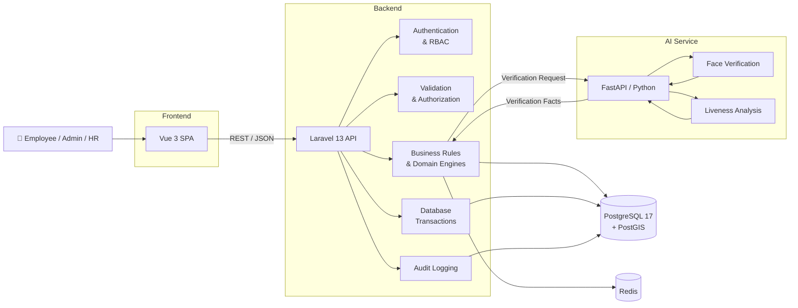
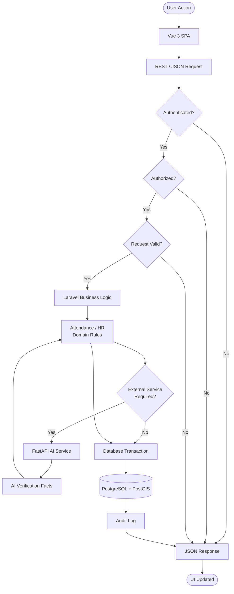
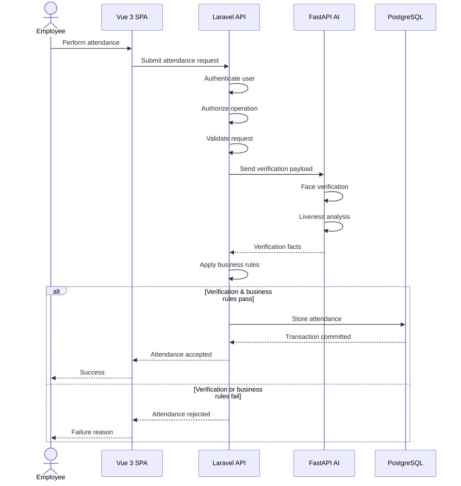
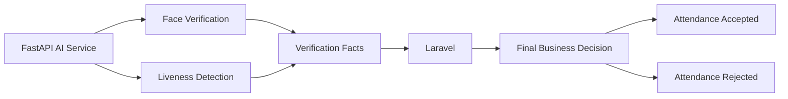
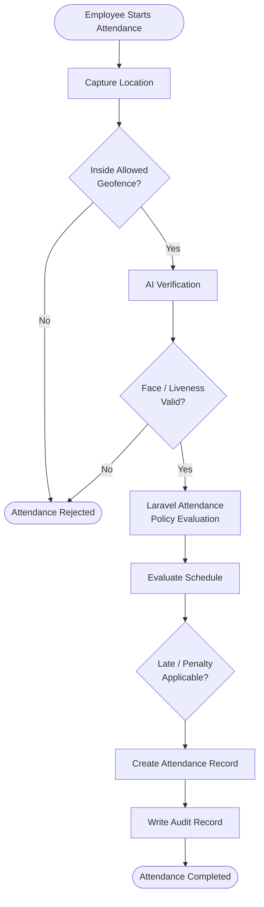
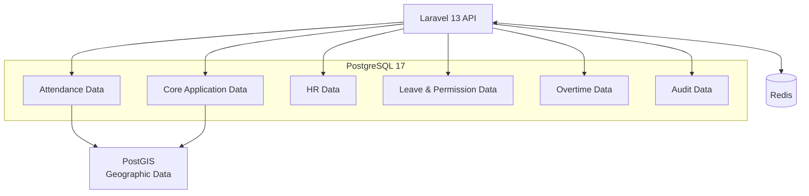
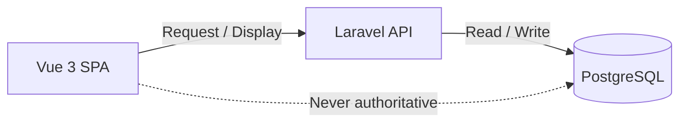
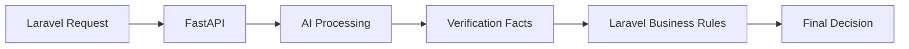
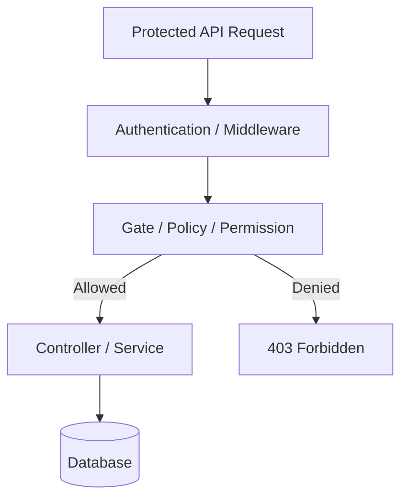
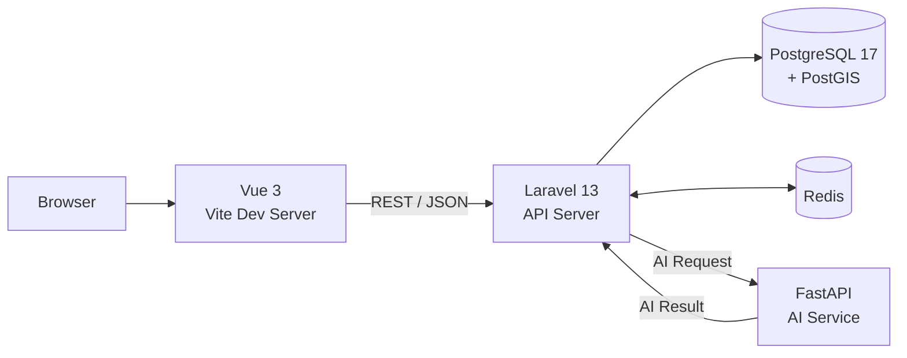

<p align="center">
  
</p>

<h1 align="center">Attendance MITO Group</h1>

<p align="center">
  Internal attendance and HR management system for MITO Group.
</p>

> **Internal & Confidential**
> This repository is intended for internal company use only and is **not an open-source project**.

---

## Purpose

The Attendance MITO Group system supports:

- Employee attendance tracking
- Check-in and check-out workflows
- Attendance policies and work schedules
- Leave and permission management
- Overtime management
- Attendance penalty management
- Monthly attendance recap and reporting
- Authorization and auditability
- Location and geofence-based attendance validation
- AI-assisted face verification and liveness checks

---

# Architecture

## System Architecture

The system uses a **Vue 3 SPA → Laravel 13 API → supporting services** architecture.



### Architecture Responsibilities

| Layer      | Responsibility                                                                 |
| ---------- | ------------------------------------------------------------------------------ |
| Vue 3      | UI, user interaction, client state, API communication                          |
| Laravel    | Authentication, authorization, validation, business rules, transactions, audit |
| PostgreSQL | Primary operational data store                                                 |
| PostGIS    | Geographic and geofence-related data                                           |
| Redis      | Cache, temporary state, queue/infrastructure support                           |
| FastAPI    | AI processing and verification                                                 |
| AI Models  | Face verification and liveness analysis                                        |

---

## Request & Business Flow

All business operations ultimately pass through Laravel.



### Important Rule

**Laravel is the final authority.**

The frontend may perform client-side validation for better UX, but it must never be trusted for business decisions or authorization.

---

# AI Verification

AI processing is isolated from the core Laravel business logic.

FastAPI provides **verification facts only**. Laravel determines what those facts mean for the attendance operation.



### AI Service Boundary



The AI service **must not**:

- Modify attendance records directly
- Apply attendance policies
- Determine leave or overtime eligibility
- Determine penalties
- Bypass Laravel authorization
- Become the source of truth for attendance data

---

# Attendance Request Flow

The typical attendance operation follows this flow:



> The exact attendance rules are defined by the backend domain implementation and project requirements. This diagram represents the architectural flow, not a replacement for the actual business rules.

---

# Data Architecture

PostgreSQL is the primary source of operational truth.



### Data Authority



The frontend never communicates directly with PostgreSQL.

---

# Repository Layout

```text
.
├── frontend/                  # Vue 3 SPA
├── backend-laravel/           # Laravel 13 API backend
├── ai-service/                # FastAPI / Python AI service
├── redis-php/                 # Redis-related local resources
│
├── AGENTS.md                  # Agent and architecture rules
├── ARCHITECTURE.md            # Detailed architecture reference
├── API-CONTRACT.md            # API contract
├── CHECKLIST.md               # Project checklist
├── DECISIONS.md               # Architecture decision log
├── DEVELOPMENT.md             # Local development guide
├── LICENSE                    # Internal proprietary license
├── PROJECT.md                 # Project scope and requirements
├── README.md                  # Project overview
├── SECURITY.md                # Internal security policy
│
├── .gitignore                 # Git ignore configuration
└── .env.example               # Example environment configuration
```

> `.env` files are local environment configuration and must never be committed.

---

# Scope & Core Rules

## 1. Laravel Is the Source of Truth

Laravel is the final authority for:

- Authentication
- Authorization
- Request validation
- Attendance decisions
- Attendance policies
- Leave and permission rules
- Overtime rules
- Penalty calculations
- Geofence validation
- Business workflows
- Database transactions
- Audit records

---

## 2. Vue Is UI-Only

Vue is responsible for:

- UI rendering
- User interaction
- Client-side state
- API communication
- Displaying backend results
- UX-level validation

Vue must **not** become the source of truth for business logic.

---

## 3. FastAPI Provides Facts

FastAPI is responsible for AI processing.



FastAPI does not own attendance business decisions.

---

## 4. Server-Side Authorization

UI visibility is **not authorization**.



Every protected operation must be authorized on the backend.

---

# Local Runtime Stack

| Component              | Technology           |
| ---------------------- | -------------------- |
| Backend                | Laravel 13           |
| PHP                    | 8.3+                 |
| Frontend               | Vue 3                |
| Build Tool             | Vite                 |
| API                    | REST / JSON          |
| Database               | PostgreSQL 17        |
| Spatial Database       | PostGIS              |
| Cache / Infrastructure | Redis                |
| AI Service             | FastAPI              |
| AI Runtime             | Python 3.11 / 3.12   |
| Package Management     | Composer / npm / pip |

---

# Development

## Backend

```powershell
Set-Location backend-laravel

composer install

php artisan migrate

php artisan serve
```

## Frontend

```powershell
Set-Location frontend

npm install

npm run dev
```

## AI Service

```powershell
Set-Location ai-service

python -m venv .venv

.\.venv\Scripts\Activate.ps1

pip install -r requirements.txt

uvicorn app.main:app --reload --port 8001
```

## Redis Validation

```powershell
redis-cli -h 127.0.0.1 -p 6379 ping
```

Expected response:

```text
PONG
```

---

# Local Service Architecture

The local development environment consists of independent services:



> Actual ports and infrastructure configuration may differ between development, staging, and production.

---

# Security Expectations

The following security rules are mandatory:

- Do not commit secrets, credentials, API keys, private keys, or sensitive environment values.
- Do not expose internal APIs publicly without explicit authorization.
- Do not log biometric payloads.
- Do not log authentication tokens.
- Do not log unnecessary private identity information.
- Keep validation enforced server-side.
- Keep authorization enforced server-side.
- Treat frontend validation as UX assistance only.
- Protect sensitive endpoints using proper authentication and authorization.
- Follow the requirements in [`SECURITY.md`](SECURITY.md).

---

# Documentation

| Document                             | Purpose                              |
| ------------------------------------ | ------------------------------------ |
| [`ARCHITECTURE.md`](ARCHITECTURE.md) | Detailed architecture reference      |
| [`API-CONTRACT.md`](API-CONTRACT.md) | API contract and integration rules   |
| [`DEVELOPMENT.md`](DEVELOPMENT.md)   | Local development guide              |
| [`PROJECT.md`](PROJECT.md)           | Project scope and requirements       |
| [`CHECKLIST.md`](CHECKLIST.md)       | Project implementation checklist     |
| [`DECISIONS.md`](DECISIONS.md)       | Technical and architecture decisions |
| [`AGENTS.md`](AGENTS.md)             | Agent and repository rules           |
| [`SECURITY.md`](SECURITY.md)         | Internal security policy             |
| [`LICENSE`](LICENSE)                 | Internal proprietary license         |

---

# Internal Usage Notice

This project is developed for internal operational and engineering use within **MITO Group**.

The source code, architecture, business rules, configuration, documentation, and related assets are confidential company resources.

Any external publishing, distribution, reproduction, modification, or reuse requires explicit written authorization.

---

# Author

**Mohammad Sultoni — Powered by MITO Group**

- GitHub: [Sultonisky](https://github.com/Sultonisky)
- Email: `muhsultonipml111@gmail.com`

---

<p align="center">
  <i>MITO Group Attendance — Internal Attendance Project Application for MITO Group</i>
</p>
