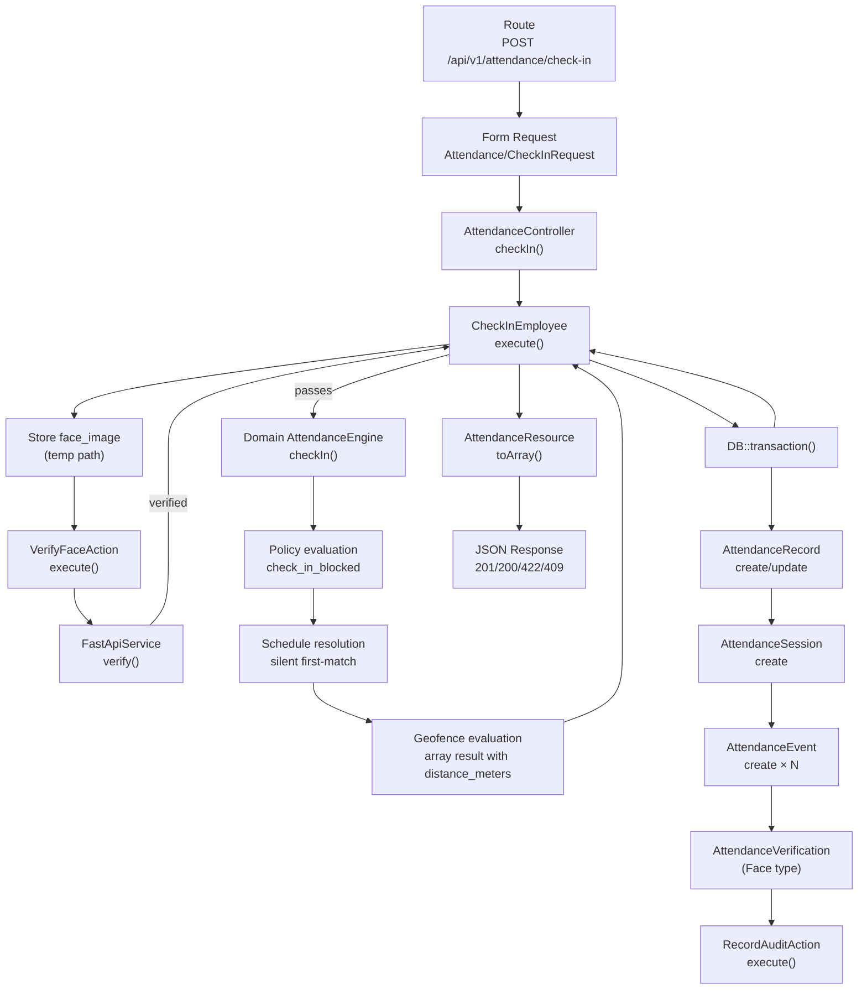
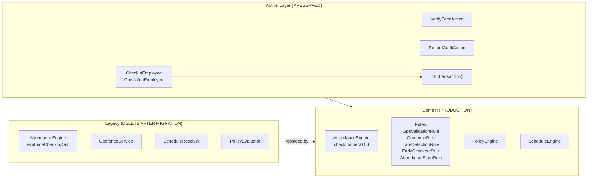

# PHASE 2B — ATTENDANCE ENGINE MIGRATION DESIGN

## 1. Repository Baseline

- **Branch:** `feat/monthly-recap-impls`
- **HEAD:** `69a389f`
- **Working tree:** Contains Phase 1 cleanup artifacts and unrelated `frontend/package-lock.json` change.
- **Conflict markers:** `0`
- **Test baseline:** 289 passed, 0 failed, 722 assertions

No production code was modified during this design phase.

---

## 2. Phase 2A Findings Confirmation

All six critical findings from Phase 2A are confirmed against the current repository.

### Finding 1 — Employment Eligibility

**Confirmed.** Legacy `Services/Attendance/AttendanceEngine.php` checks `employment_status !== 'permanent' && !== 'contract'`. Domain `Domain/Attendance/Engines/AttendanceEngine.php` checks `end_date && end_date->isPast()`. These are semantically different.

### Finding 2 — Policy

**Confirmed.** Legacy `PolicyEvaluator` returns all active policies and evaluates `check_in_blocked`/`check_out_blocked`. Domain `PolicyEngine` returns exactly one policy or throws, and does not evaluate block flags.

### Finding 3 — Face Verification

**Confirmed.** Domain engine creates only `Geofence` verification records. Face verification exists only in `CheckInEmployee`/`CheckOutEmployee` actions via `VerifyFaceAction`.

### Finding 4 — Transaction Ownership

**Confirmed.** Legacy: action layer owns `DB::transaction()`. Domain: engine has no transaction boundaries.

### Finding 5 — Exception Model

**Confirmed.** Domain engine throws 6 exception types with no HTTP mapping in the current controller.

### Finding 6 — Schedule Ambiguity

**Confirmed.** Legacy silently picks first assignment. Domain throws `AmbiguousScheduleAssignmentException`.

---

## 3. Executive Summary

The migration from `Services/Attendance/*` to `Domain/Attendance/*` is **technically feasible** but requires **one business decision** before implementation can begin.

All other gaps are technical and can be closed during Phase 2C implementation.

### Decision D-01 — DECIDED

**Status:** DECIDED

**Resolution:**
- `permanent` → allowed
- `contract` → allowed
- `outsource` → allowed
- `probation` → treated as `contract` (normalized, not a new independent attendance eligibility category)
- `end_date` past → blocked (regardless of employment_status)

**Rationale:** MITO confirmed that probation employees are functionally equivalent to contract employees for attendance purposes. Outsource employees are explicitly allowed. The domain engine's `end_date` check is the authoritative gate for employment termination.

**Implementation:** The domain engine continues to use `end_date` as the employment termination check. Probation employees pass through automatically because their `end_date` is null or in the future. No special-case probation logic is required in the attendance engine.

**Note:** The `EmploymentStatus` enum retains `Probation` and `Outsource` cases for data representation. They are not removed. Attendance eligibility is determined by `end_date`, not by enum value.

### Technical Decisions (All Decided in This Document)

- **Transaction ownership:** Remain in Action layer.
- **Face verification:** Remain in Action layer; domain engine receives pre-verified face result via DTO or method parameter.
- **Policy multiplicity:** Preserve legacy behavior (allow multiple, evaluate block flags in AttendanceEngine).
- **Schedule ambiguity:** Preserve legacy behavior (silent first-match).
- **Exception mapping:** Catch domain exceptions in Actions; convert to legacy array contract for controller compatibility.
- **API contract:** Preserve exact current response shape via Action bridge.
- **Geofence:** Wrap `GeofenceRule` in Action to produce legacy array result.

### Migration Strategy

**In-place swap with bridge layer.** The Actions (`CheckInEmployee`, `CheckOutEmployee`) become the migration bridge. They will:
1. Inject the Domain Attendance Engine.
2. Catch domain exceptions.
3. Reconstruct legacy array responses.
4. Preserve transaction ownership.
5. Preserve face verification flow.

This allows the Domain Engine to evolve its internal contract without breaking the API.

---

## 4. Business vs Technical Decisions

| Category | Count | Description |
|----------|-------|-------------|
| Business decisions | 1 | Employment eligibility rule |
| Technical decisions | 9 | All other gaps |

### Business Decisions

| ID | Topic | Options | Risk if Unresolved |
|----|-------|---------|-------------------|
| D-01 | Employment eligibility | A) Block non-permanent/non-contract (legacy) B) Allow all with non-past end_date (domain) C) Hybrid | HIGH — migration would change who can attend |

### Technical Decisions

| ID | Topic | Decision | Rationale |
|----|-------|----------|-----------|
| D-02 | Policy multiplicity | **Preserve legacy:** return all policies, evaluate block flags in engine | Matches current production behavior; no data cleanup required |
| D-03 | Policy block flags | **Add to AttendanceEngine:** evaluate `check_in_blocked`/`check_out_blocked` from policy configuration | Keeps policy evaluation in attendance domain where it belongs |
| D-04 | Face verification | **Remain in Action layer:** domain engine receives pre-verified result | FastAPI is integration concern; domain engine should not depend on HTTP client |
| D-05 | Transaction boundary | **Remain in Action layer:** `CheckInEmployee`/`CheckOutEmployee` own `DB::transaction()` | Preserves current rollback semantics; minimizes engine surface area |
| D-06 | Exception mapping | **Actions catch domain exceptions, return legacy array shape** | Controller and Resource remain unchanged |
| D-07 | Schedule ambiguity | **Preserve legacy:** silent first-match by `effective_from DESC` | Matches current behavior; `AmbiguousScheduleAssignmentException` remains unused in attendance |
| D-08 | Geofence semantics | **Wrap `GeofenceRule` in engine to return array** | Keeps PostGIS/`ST_DWithin` improvement; matches legacy array contract |
| D-09 | API response compatibility | **Action bridge reconstructs `geofence`/`policy`/`error` arrays** | No frontend changes required |
| D-10 | Audit ownership | **Remain in Action layer** | `RecordAuditAction` stays in action; engine does not create audit logs |

---

## 5. Decision Matrix

| ID | Topic | Current Legacy | Current Domain | Problem | Decision | Owner | Status |
|----|-------|---------------|---------------|---------|----------|-------|--------|
| D-01 | Employment eligibility | `employment_status in ['permanent','contract']` | `end_date is null or future` | Semantic mismatch | probation=contract, outsource=allowed, end_date gate | Business | DECIDED |
| D-02 | Policy multiplicity | Returns all policies | Throws on multiple | Behavioral difference | Preserve legacy: return all | Technical | DECIDED |
| D-03 | Policy block flags | Evaluates in engine | Missing | Missing functionality | Add to AttendanceEngine | Technical | DECIDED |
| D-04 | Face verification | In action | Not in engine | Missing in domain | Keep in action, pass result to engine | Technical | DECIDED |
| D-05 | Transaction boundary | Action layer | None in engine | Responsibility gap | Keep in action layer | Technical | DECIDED |
| D-06 | Exception mapping | Error strings | Domain exceptions | No HTTP mapping | Catch in action, return arrays | Technical | DECIDED |
| D-07 | Schedule ambiguity | Silent first-match | Throws exception | Behavioral difference | Preserve legacy silent match | Technical | DECIDED |
| D-08 | Geofence semantics | Returns array | Throws exception | Caller contract mismatch | Wrap in engine, return array | Technical | DECIDED |
| D-09 | API response compatibility | Array with geofence/policy/error | DTO only | Response contract gap | Action bridge reconstructs arrays | Technical | DECIDED |
| D-10 | Audit ownership | Action layer | None in engine | Missing audit | Keep in action layer | Technical | DECIDED |

---

## 6. Employment Eligibility Design

### Current Legacy Behavior

**File:** `app/Services/Attendance/AttendanceEngine.php`

```php
if ($employee->employment_status !== 'permanent' && $employee->employment_status !== 'contract') {
    return ['status' => AttendanceStatus::Absent, ..., 'error' => 'Employee employment status is inactive.'];
}
```

- **Allowed:** `permanent`, `contract`
- **Blocked:** `probation` (normalized to contract), `outsource` (now allowed), `resigned`, `terminated`, etc. with past `end_date`
- **No date check:** `join_date` and `end_date` are ignored in legacy engine.

### Current Domain Behavior

**File:** `app/Domain/Attendance/Engines/AttendanceEngine.php`

```php
if ($employee->end_date && $employee->end_date->isPast()) {
    throw new InactiveEmployeeException('Employee has ended employment.');
}
```

- **Allowed:** Any `employment_status` with `end_date` null or future.
- **Probation employees:** Allowed (treated as contract via `end_date` gate).
- **Outsource employees:** Allowed (if `end_date` not past).
- **Date-driven:** Uses `end_date` as the authoritative employment termination signal.

### Decision D-01 — DECIDED

**Resolution:**
- `permanent` → allowed
- `contract` → allowed
- `outsource` → allowed
- `probation` → treated as `contract` (normalized, not a new independent attendance eligibility category)
- `end_date` past → blocked (regardless of `employment_status`)

**Rationale:** MITO confirmed that probation employees are functionally equivalent to contract employees for attendance purposes. Outsource employees are explicitly allowed. The domain engine's `end_date` check is the authoritative gate for employment termination.

**Implementation:** The domain engine continues to use `end_date` as the employment termination check. Probation employees pass through automatically because their `end_date` is null or in the future. No special-case probation logic is required in the attendance engine.

**Note:** The `EmploymentStatus` enum retains `Probation` and `Outsource` cases for data representation. They are not removed. Attendance eligibility is determined by `end_date`, not by enum value.

### Legacy Engine Alignment

During migration, the domain engine's `end_date` check is preserved as the authoritative rule. The legacy engine's `employment_status` check is superseded by this decision. No data migration is required because:
- Existing probation employees have `end_date` null or future → they will be allowed.
- Existing outsource employees with past `end_date` will be blocked.
- Existing permanent/contract employees are unaffected.

### DECISION D-01 — DECIDED

**Status:** DECIDED
**Rationale:** Probation is normalized to contract. Outsource is allowed. `end_date` is the single source of truth for employment termination.

---

## 7. Policy Design

### Current Legacy Behavior

**File:** `app/Services/Attendance/PolicyEvaluator.php`

- Returns ALL active policy assignments for the date.
- Evaluates `configuration['attendance']['check_in_blocked']` and `check_out_blocked`.
- Multiple policies allowed.
- Inactive policies silently filtered by query.

### Current Domain Behavior

**File:** `app/Domain/Policy/Engines/PolicyEngine.php`

- Returns exactly one policy.
- Throws `AmbiguousPolicyAssignmentException` on multiple.
- Throws `InactivePolicyException` on inactive policy.
- Does not evaluate block flags.

### Canonical Design

**Decision D-02:** Preserve legacy multiplicity in the Attendance context.

The Domain `PolicyEngine` is used by Penalty, Overtime, and Monthly Recap engines. Those consumers may have different requirements. **Do not change `PolicyEngine` globally.**

Instead, the Attendance Engine will use a **new attendance-specific policy evaluation** that:
1. Calls `PolicyEngine::resolve()` to get the primary policy.
2. If `AmbiguousPolicyAssignmentException` is thrown, falls back to the legacy behavior: query all active assignments for the date and use the latest `effective_from`.
3. Evaluates `check_in_blocked` and `check_out_blocked` from the active policy configuration.

**New method in `Domain\Attendance\Engines\AttendanceEngine`:**

```php
private function resolvePolicyForCheckIn(Employee $employee, CarbonImmutable $date): array
{
    try {
        $policyData = $this->policyEngine->resolve($employee, $date);
        $policies = $policyData->hasPolicy() ? [$policyData->policy] : [];
    } catch (AmbiguousPolicyAssignmentException $e) {
        $policies = $this->queryActivePolicies($employee, $date);
    } catch (InactivePolicyException $e) {
        $policies = $this->queryActivePolicies($employee, $date);
    }

    foreach ($policies as $policy) {
        $configuration = $policy->configuration ?? [];
        if (($configuration['attendance']['check_in_blocked'] ?? false) === true) {
            return ['allowed' => false, 'reason' => $policy->name ?? 'Attendance blocked by policy.', 'policies' => $policies];
        }
    }

    return ['allowed' => true, 'reason' => null, 'policies' => $policies];
}
```

**Same pattern for `resolvePolicyForCheckOut()`.**

**Rationale:**
- Preserves current production behavior exactly.
- Keeps `PolicyEngine` clean for other consumers.
- Attendance-specific block evaluation lives in AttendanceEngine where it belongs.

### DECISION D-02 — DECIDED

**Status:** DECIDED
**Rationale:** Changing `PolicyEngine` globally would affect Penalty, Overtime, and Monthly Recap. Attendance has unique block-flag requirements. Attendance-specific policy evaluation belongs in AttendanceEngine.

---

## 8. Schedule Design

### Current Legacy Behavior

**File:** `app/Services/Attendance/ScheduleResolver.php`

- Queries `ScheduleAssignment` with effective date range.
- Orders by `effective_from DESC`, takes first.
- Returns first shift via `shifts->first()`.
- Cross-midnight: if `hour < 3` and no shift found, re-checks previous day.

### Current Domain Behavior

**File:** `app/Domain/Schedule/Engines/ScheduleEngine.php`

- Queries all assignments for date range.
- Throws `AmbiguousScheduleAssignmentException` if more than one.
- Throws `InactiveScheduleException` if schedule status not `active`.
- Returns `ScheduleResolutionData` with `schedule` only.

### Canonical Design

**Decision D-07:** Preserve legacy schedule resolution behavior in the Attendance context.

The Domain `ScheduleEngine` is shared with Penalty, Overtime, and Monthly Recap. Those engines may benefit from strict ambiguity detection. **Do not change `ScheduleEngine` globally.**

Instead, the Domain `AttendanceEngine` will use a **new attendance-specific schedule resolution** that:
1. Queries `ScheduleAssignment` with the same effective date range.
2. Orders by `effective_from DESC`, takes first (legacy behavior).
3. Does NOT throw on multiple assignments.
4. Does NOT validate `WorkSchedule.status` (legacy behavior: returns null shift if inactive).
5. Returns the first shift.

**New private method in `Domain\Attendance\Engines\AttendanceEngine`:**

```php
private function resolveScheduleForAttendance(Employee $employee, CarbonImmutable $date): array
{
    $assignment = ScheduleAssignment::query()
        ->where('employee_id', $employee->id)
        ->where('effective_from', '<=', $date->toDateString())
        ->where(function ($query) use ($date) {
            $query->whereNull('effective_to')
                ->orWhere('effective_to', '>=', $date->toDateString());
        })
        ->with(['workSchedule.shifts' => function ($query) {
            $query->orderBy('start_time');
        }])
        ->orderByDesc('effective_from')
        ->first();

    if ($assignment === null) {
        return ['schedule' => null, 'shift' => null];
    }

    $schedule = $assignment->workSchedule;

    return [
        'schedule' => $schedule,
        'shift' => $schedule?->shifts->first(),
    ];
}
```

**Cross-midnight logic:** The domain engine's `resolveWorkDate()`, `resolveScheduledStart()`, and `resolveScheduledEnd()` already implement the correct cross-midnight logic using `shift->cross_midnight` and `current_time < shift->end_time`. This is **superior** to the legacy `hour < 3` hardcoded check and should be preserved.

### DECISION D-07 — DECIDED

**Status:** DECIDED
**Rationale:** `ScheduleEngine` is shared across multiple domain engines. Attendance-specific schedule resolution (silent first-match, no inactive validation) belongs in `AttendanceEngine` to avoid changing behavior for Penalty, Overtime, and Monthly Recap.

---

## 9. Geofence Design

### Current Legacy Behavior

**File:** `app/Services/Attendance/GeofenceService.php`

- PostGIS: `ST_DDistance` + scalar compare to `radius_meters`.
- Scalar: Haversine distance.
- Returns `array{passed, distance_meters, method}`.
- Null coordinates → `passed: true, method: 'scalar_unverified'`.

### Current Domain Behavior

**File:** `app/Domain/Attendance/Rules/GeofenceRule.php`

- PostGIS: `ST_DWithin` with geography.
- Scalar: Haversine distance.
- Throws `OutsideGeofenceException` if outside.
- Null coordinates → returns silently (no exception).

### Canonical Design

**Decision D-08:** Keep `GeofenceRule` as-is (exception-throwing). Wrap it in `AttendanceEngine` to produce the legacy array result.

**Rationale:**
- `ST_DWithin` is the more idiomatic PostGIS approach.
- Exception-throwing rules are the standard domain pattern.
- The Action layer needs the array result for the API response, so wrapping happens at the engine boundary.

**Implementation in `AttendanceEngine::evaluateGeofence()`:**

```php
private function evaluateGeofence(?WorkLocation $workLocation, ?float $latitude, ?float $longitude): array
{
    if ($workLocation === null || $latitude === null || $longitude === null) {
        return ['passed' => true, 'distance_meters' => null, 'method' => 'skipped'];
    }

    try {
        $this->geofenceRule->validate($workLocation, $latitude, $longitude);
        $distanceMeters = $this->queryGeofenceDistance($workLocation, $latitude, $longitude);
        return ['passed' => true, 'distance_meters' => $distanceMeters, 'method' => 'postgis'];
    } catch (OutsideGeofenceException $e) {
        $distanceMeters = $this->queryGeofenceDistance($workLocation, $latitude, $longitude);
        return ['passed' => false, 'distance_meters' => $distanceMeters, 'method' => 'postgis'];
    }
}

private function queryGeofenceDistance(WorkLocation $workLocation, float $latitude, float $longitude): ?float
{
    return WorkLocation::where('id', $workLocation->id)
        ->selectRaw('ST_DDistance(location_point, ST_SetSRID(ST_MakePoint(?, ?), 4326)::geography) AS distance_meters', [$longitude, $latitude])
        ->value('distance_meters');
}
```

**`distance_meters` Resolution:**

The legacy `GeofenceService` returns actual `distance_meters` from the PostGIS `ST_DDistance` query. The domain `GeofenceRule` validates pass/fail only and does not return distance.

**Decision D-08a:** The `AttendanceEngine` wrapper (`evaluateGeofence()`) runs a lightweight `ST_DDistance` query via `queryGeofenceDistance()` to populate `distance_meters`. `GeofenceRule::validate()` remains the boolean validator. This preserves the exact legacy API response contract, including `distance_meters`.

The Action layer receives the full array from the engine and passes it directly to `AttendanceResource`. No `distance_meters: null` is returned in production when coordinates are present.

### DECISION D-08 — DECIDED

**Status:** DECIDED
**Rationale:** `GeofenceRule` is semantically equivalent and uses better PostGIS. Wrapping in engine preserves API contract.

---

## 10. Face Verification Design

### Current Production Flow

```
Controller
  → Store face_image to temp path
  → Action::execute(employee, occurredAt, context, actorId, request, faceImagePath)
    → Legacy Engine::evaluateCheckIn/Out()
    → Action::verifyFaceForAttendance()
      → VerifyFaceAction::execute()
        → FastApiService::verify()
        → Laravel decision: faceDetected + verified + liveness
      → Returns {status, passed, result, error}
    → If passed: create AttendanceVerification (Face type)
    → DB::transaction:
        → AttendanceRecord
        → AttendanceSession
        → AttendanceEvent
        → AttendanceVerification (Face)
        → AuditLog
```

### Proposed Target Flow

```
Controller
  → Store face_image to temp path
  → Action::execute(employee, occurredAt, context, actorId, request, faceImagePath)
    → Domain Engine::checkIn/Out()
      → Returns AttendanceResultData OR throws domain exception
    → Action::verifyFaceForAttendance()  [SAME AS LEGACY]
      → VerifyFaceAction::execute()
        → FastApiService::verify()
        → Laravel decision
      → Returns {status, passed, result, error}
    → If passed: create AttendanceVerification (Face type)
    → DB::transaction:
        → AttendanceRecord
        → AttendanceSession
        → AttendanceEvent
        → AttendanceVerification (Face)
        → AuditLog
```

### Key Design Decisions

1. **Face verification stays in the Action layer.** The domain engine does not call FastAPI. This preserves the architectural boundary: FastAPI is integration infrastructure, not domain logic.

2. **Domain engine creates a Geofence verification record.** This is acceptable because:
   - The Face verification record is created by the Action after the engine returns.
   - Both records can coexist in the same transaction.
   - The legacy flow also creates only one verification type per attendance event.

3. **If face verification fails, the entire transaction is not rolled back.** Wait — actually, in the legacy flow, if face verification fails, the action returns early BEFORE entering the transaction. No attendance record is created. This must be preserved.

4. **FastAPI call happens outside the transaction.** This is correct because:
   - Network I/O inside a DB transaction can cause long-held locks.
   - If attendance persistence fails after face verification, the face verification result is simply discarded (no record created).
   - This matches the legacy behavior.

### DECISION D-04 — DECIDED

**Status:** DECIDED
**Rationale:** FastAPI is an integration concern. The domain engine should not depend on HTTP clients. Face verification remains in the action layer, before the transaction boundary.

---

## 11. Transaction Design

### Current Legacy Behavior

**File:** `app/Actions/Attendance/CheckInEmployee.php`, `CheckOutEmployee.php`

- `DB::transaction()` wraps all persistence.
- FastAPI call happens outside transaction.
- Face verification happens outside transaction.
- If any write fails, all writes roll back.

### Proposed Target Behavior

**Transaction ownership remains in the Action layer.**

**Rationale:**
- The Action layer is the application orchestration boundary.
- It coordinates: engine evaluation → face verification → persistence → audit.
- Keeping the transaction in the action layer means the engine can be tested without transactions.
- It preserves the current behavior exactly.

**Transaction contents:**
1. `AttendanceRecord::create()` or `->update()`
2. `AttendanceSession::create()` or `->update()`
3. `AttendanceEvent::create()` × N
4. `AttendanceVerification::create()` (Face type, if verified)
5. `RecordAuditAction::execute()`

**If the domain engine is extended to create Geofence verification records internally:**
- The action must still create the Face verification record.
- Both records can coexist.
- OR: the action deletes the engine-created Geofence record and replaces it with the Face record. This is wasteful.

**Recommended:** The action creates only the Face verification record. The engine does NOT create a Geofence verification record. Instead, the engine's `AttendanceResultData` includes a `verification` field that is `null` for geofence-only results, and the action creates the appropriate verification record after the engine returns.

**Actually, simpler approach:** The domain engine should NOT create `AttendanceVerification` at all. Verification creation belongs in the action layer because:
1. Face verification is action-level.
2. The type of verification (Face vs Geofence) depends on action-level context.
3. The action already creates verification records in the legacy flow.

**Revised domain engine behavior:**
- `checkIn()` and `checkOut()` do NOT create `AttendanceVerification`.
- They return `AttendanceResultData` with `verification: null`.
- The action creates the appropriate verification record inside the transaction.

### DECISION D-05 — DECIDED

**Status:** DECIDED
**Rationale:** Action layer owns the transaction. Engine does not create verification records. Action creates verification records based on face verification result.

---

## 12. Exception Design

### Current Domain Exceptions

| Exception | Trigger | HTTP Status | API Error Code |
|-----------|---------|-------------|----------------|
| `InactiveEmployeeException` | `end_date` past | 422 | `data.error` |
| `InvalidLocationException` | Invalid GPS | 422 | `data.error` |
| `OutsideGeofenceException` | Outside geofence | 422 | `data.error` |
| `AttendanceAlreadyCheckedInException` | Open session exists | 409 | `data.error` |
| `NoOpenAttendanceSessionException` | No open session | 422 | `data.error` |

### Exception Mapping Strategy

**Decision D-06:** Catch all domain exceptions in `CheckInEmployee` and `CheckOutEmployee` actions. Convert to the legacy array shape expected by `AttendanceController`.

**Implementation in Actions:**

```php
try {
    $result = $this->engine->checkIn($employee, $data);
} catch (InactiveEmployeeException $e) {
    return $this->mapError(AttendanceStatus::Absent, 'Employee employment status is inactive.', null, null, false);
} catch (InvalidLocationException $e) {
     return $this->mapError(AttendanceStatus::Absent, $e->getMessage(), null, null, false);
} catch (OutsideGeofenceException $e) {
    return $this->mapError(AttendanceStatus::Incomplete, 'Employee is outside the approved work location geofence.', null, null, false);
} catch (AttendanceAlreadyCheckedInException $e) {
    return $this->mapError(AttendanceStatus::Incomplete, 'Employee already has an open attendance session.', null, null, true);
} catch (NoOpenAttendanceSessionException $e) {
    // Only for check-out
    return $this->mapError(AttendanceStatus::Incomplete, 'No open attendance session found.', null, null, false);
}
```

**Controller compatibility:** `AttendanceController` already checks `$result['error']` and `$result['conflict']` to determine status code. No controller changes needed.

### DECISION D-06 — DECIDED

**Status:** DECIDED
**Rationale:** Actions are the natural exception boundary between domain and transport. Controller and Resource remain unchanged.

---

## 13. API Contract Compatibility

### Current Success Response (201/200)

```json
{
  "success": true,
  "data": {
    "id": 1,
    "employee_id": 1,
    "attendance_date": "2026-09-12",
    "status": "present",
    "sessions": [...],
    "geofence": {"passed": true, "distance_meters": null, "method": "postgis"},
    "policy": {"allowed": true, "reason": null, "policies": []},
    "error": null,
    "created_at": "...",
    "updated_at": "..."
  }
}
```

### Current Error Response (422/409)

```json
{
  "success": false,
  "data": {
    "status": "incomplete",
    "error": "Employee employment status is inactive.",
    "geofence": {"passed": true, "distance_meters": null, "method": "skipped"},
    "policy": {"allowed": false, "reason": "...", "policies": []},
  }
}
```

### Compatibility Strategy

**Decision D-09:** The Action layer reconstructs the exact legacy response shape.

The domain engine returns `AttendanceResultData` which contains:
- `attendanceRecord`
- `session`
- `verification` (null for geofence-only)
- `message`

The Action layer:
1. Calls the engine.
2. On success: builds the `geofence` and `policy` arrays from evaluation data, constructs the `AttendanceResource` payload.
3. On exception: catches and builds the error response.

**No changes to `AttendanceResource`, `AttendanceSessionResource`, or `AttendanceController` are required.**

### DECISION D-09 — DECIDED

**Status:** DECIDED
**Rationale:** The API contract is a stable external interface. The action layer is the correct place to bridge domain outputs to API responses.

---

## 14. Persistence Design

| Entity | Legacy Writer | Domain Writer | Target Writer | Transaction |
|--------|--------------|---------------|---------------|-------------|
| `AttendanceRecord` | CheckInEmployee action | Domain engine | Action | Yes |
| `AttendanceSession` | CheckInEmployee/CheckOutEmployee action | Domain engine | Action | Yes |
| `AttendanceEvent` | CheckInEmployee/CheckOutEmployee action | Domain engine | Action | Yes |
| `AttendanceVerification` (Face) | CheckInEmployee/CheckOutEmployee action | None | Action | Yes |
| `AttendanceVerification` (Geofence) | None (legacy) | Domain engine | **Action** (engine does not create) | Yes |
| `AuditLog` | RecordAuditAction in action | None | Action | Yes |

### Revised Engine Contract

The Domain `AttendanceEngine` will:
- Return `AttendanceResultData` with `attendanceRecord`, `session`, `verification` (null for now).
- NOT create `AttendanceVerification`.
- NOT create `AuditLog`.

The Action layer will:
- Create `AttendanceVerification` (Face type) if face verification passes.
- Create `AuditLog` via `RecordAuditAction`.
- Wrap all in `DB::transaction()`.

### DECISION D-10 — DECIDED

**Status:** DECIDED
**Rationale:** Audit and verification creation depend on action-level context (face result, request metadata). Keeping them in the action layer preserves separation of concerns.

---

## 15. Business Rule Ownership

| Rule | Current Owner | Target Owner | Migration Action |
|------|--------------|--------------|-----------------|
| Employee eligibility | Legacy engine | Domain engine | Align semantics (D-01 resolved: probation treated as contract, outsource allowed, end_date gate) |
| Schedule resolution | Legacy `ScheduleResolver` | Domain `ScheduleEngine` + AttendanceEngine wrapper | Preserve legacy silent-first behavior in engine |
| Policy resolution | Legacy `PolicyEvaluator` | Domain `PolicyEngine` + AttendanceEngine wrapper | Preserve legacy multiplicity + block flags in engine |
| Geofence validation | Legacy `GeofenceService` | Domain `GeofenceRule` | Wrap in engine for array result |
| GPS validation | Domain `GpsValidationRule` | Domain `GpsValidationRule` | No change |
| Late detection | Legacy comment | Domain `LateDetectionRule` | Wire grace period from policy |
| Early checkout | Legacy comment | Domain `EarlyCheckoutRule` | No change |
| Status determination | Legacy `determineStatus()` | Domain `AttendanceStateRule` | No change |
| Open session guard | Legacy action | Domain engine | Engine-level check (already implemented) |
| Face verification | Action (`VerifyFaceAction`) | Action (`VerifyFaceAction`) | No change |
| FastAPI call | Action (`FastApiService`) | Action (`FastApiService`) | No change |
| Audit | Action (`RecordAuditAction`) | Action (`RecordAuditAction`) | No change |
| Transaction | Action | Action | No change |
| Record persistence | Legacy action | Action | No change |
| Session persistence | Legacy action | Action | No change |
| Event persistence | Legacy action | Action | No change |
| Verification persistence | Action | Action | No change |

---

## 16. Legacy → Domain Mapping

| Legacy Component | Domain Target | Reuse | Rewrite | Missing Functionality | Risk |
|-----------------|--------------|-------|---------|----------------------|------|
| `Services/Attendance/AttendanceEngine` | `Domain/Attendance/Engines/AttendanceEngine` | Structure, method names | Employment check, policy evaluation, geofence wrapping, verification omission | Face verification, transaction, audit, array return | HIGH |
| `Services/Attendance/GeofenceService` | `Domain/Attendance/Rules/GeofenceRule` | PostGIS/scalar logic | None | Array return, distance_meters | LOW |
| `Services/Attendance/ScheduleResolver` | `Domain/Schedule/Engines/ScheduleEngine` | Date range query | None | Silent first-match, inactive schedule handling | HIGH |
| `Services/Attendance/PolicyEvaluator` | `Domain/Policy/Engines/PolicyEngine` + AttendanceEngine wrapper | Active policy query | Block flag evaluation | Multiplicity, block flags | HIGH |

**Legend:**
- **REUSE:** Use as-is.
- **ADAPT:** Modify to match target behavior.
- **REWRITE:** Significant changes required.
- **DELETE AFTER MIGRATION:** Safe to remove once production references are gone.
- **KEEP TEMPORARILY:** Required during migration but removable after.

---

## 17. File-by-File Migration Plan

**Cross-reference:** The detailed file changes below map to the implementation timeline in Section 20 (Migration Sequence).
- Section 17 "Phase 2C.1" → PHASE 2C.2 (Extend Domain Engine)
- Section 17 "Phase 2C.2/2C.3" → PHASE 2C.3 (Update Actions)
- Section 17 "Phase 2C.4" → PHASE 2C.4 (Switch Production Dependency)
- Section 17 "Phase 2C.5" → PHASE 2C.6 (Remove Legacy Services)

### Phase 2C.1 — Extend Domain AttendanceEngine (implements PHASE 2C.2)

**MODIFY:** `app/Domain/Attendance/Engines/AttendanceEngine.php`

**Changes:**
1. Replace `end_date` employment check with `employment_status` check (D-01 resolved: keep `end_date` check, probation normalized to contract, outsource allowed).
2. Add `evaluatePolicyForCheckIn()` and `evaluatePolicyForCheckOut()` methods that:
   - Call `PolicyEngine::resolve()`.
   - Fall back to querying all active policies on ambiguity/inactive.
   - Evaluate `check_in_blocked`/`check_out_blocked`.
3. Add `resolveScheduleForAttendance()` that mimics legacy silent first-match.
4. Add `evaluateGeofence()` that wraps `GeofenceRule` and returns array.
5. Remove `createVerification()` call from `checkIn()` and `checkOut()`.
6. Remove `AttendanceVerification` creation from engine.
7. Update `AttendanceResultData` usage to set `verification: null`.

**Dependencies:** `PolicyEngine`, `ScheduleEngine`, `GeofenceRule`, `GpsValidationRule`, `LateDetectionRule`, `EarlyCheckoutRule`, `AttendanceStateRule`

**Tests affected:** None (no production tests target domain engine directly yet).

**Migration order:** PHASE 2C.2

**Rollback:** Domain engine remains unused until PHASE 2C.4. Safe to iterate.

---

### Phase 2C.2 — Update CheckInEmployee Action (implements PHASE 2C.3)

**MODIFY:** `app/Actions/Attendance/CheckInEmployee.php`

**Changes:**
1. Change constructor injection from `App\Services\Attendance\AttendanceEngine` to `App\Domain\Attendance\Engines\AttendanceEngine`.
2. Add `use App\Domain\Attendance\Engines\AttendanceEngine;`.
3. Remove `use App\Services\Attendance\AttendanceEngine;`.
4. Replace `$this->engine->evaluateCheckIn()` call with `$this->engine->checkIn()`.
5. Build `AttendanceOperationData` from context.
6. Wrap engine call in try/catch for domain exceptions.
7. On exception: return mapped error array.
8. On success: receive `AttendanceResultData`, extract `record` and `session`.
9. Preserve face verification flow (unchanged).
10. Preserve `DB::transaction()` with all persistence.
11. Preserve `RecordAuditAction::execute()`.

**Dependencies:** Domain `AttendanceEngine`, `VerifyFaceAction`, `RecordAuditAction`

**Tests affected:** `AttendanceDirectActionTest` (must be rewritten in PHASE 2C.6).

**Migration order:** PHASE 2C.3

**Rollback:** Revert constructor injection and method call.

---

### Phase 2C.3 — Update CheckOutEmployee Action (implements PHASE 2C.3)

**MODIFY:** `app/Actions/Attendance/CheckOutEmployee.php`

**Changes:** Same pattern as `CheckInEmployee`.

**Migration order:** PHASE 2C.3

**Rollback:** Revert constructor injection and method call.

---

### Phase 2C.4 — Switch Production Dependency (implements PHASE 2C.4)

**FILES:**
- `app/Actions/Attendance/CheckInEmployee.php`
- `app/Actions/Attendance/CheckOutEmployee.php`

**Changes:**
1. Change `use App\Services\Attendance\AttendanceEngine;` to `use App\Domain\Attendance\Engines\AttendanceEngine;`.
2. Ensure constructor type-hint uses domain class.

**Migration order:** PHASE 2C.4

**Rollback:** Revert use statement.

---

### Phase 2C.5 — Remove Legacy Services (implements PHASE 2C.6)

**DELETE:**
- `app/Services/Attendance/AttendanceEngine.php`
- `app/Services/Attendance/GeofenceService.php`
- `app/Services/Attendance/ScheduleResolver.php`
- `app/Services/Attendance/PolicyEvaluator.php`

**REWRITE:** `tests/Feature/Attendance/AttendanceDirectActionTest.php` to use domain engine.

**Migration order:** PHASE 2C.6

**Prerequisite:** Full test suite green, no production references to legacy services.

---

## 18. Test Migration Strategy

### Tests to Add in Phase 2C.1

| Test | Layer | Purpose |
|------|-------|---------|
| `test_check_in_with_probation_employee` | Feature | Employment eligibility (D-01: probation treated as contract, allowed) |
| `test_check_in_with_outsource_employee` | Feature | Employment eligibility (D-01: outsource allowed) |
| `test_check_in_with_ended_employee` | Feature | `end_date` past check |
| `test_check_in_with_multiple_policies` | Feature | Policy multiplicity fallback |
| `test_check_in_with_inactive_policy` | Feature | Inactive policy fallback |
| `test_check_in_blocked_by_policy` | Feature | `check_in_blocked` flag |
| `test_check_out_blocked_by_policy` | Feature | `check_out_blocked` flag |
| `test_check_in_with_overlapping_schedules` | Feature | Schedule ambiguity silent first-match |
| `test_check_in_with_inactive_schedule` | Feature | Inactive schedule returns absent |
| `test_geofence_boundary_inside` | Feature | Geofence pass |
| `test_geofence_boundary_outside` | Feature | Geofence fail |
| `test_domain_engine_transaction_rollback` | Feature | Transaction ownership |
| `test_face_verification_success_creates_face_record` | Feature | Face verification type |
| `test_face_verification_failure_prevents_attendance` | Feature | Face verification gate |
| `test_engine_does_not_create_verification` | Unit | Engine contract |
| `test_engine_returns_null_verification` | Unit | DTO contract |

### Tests to Modify

| Test | Current | Required Change |
|------|---------|-----------------|
| `AttendanceDirectActionTest` | Instantiates legacy engine | Rewrite to instantiate domain engine |
| `AttendanceEngineTest` | HTTP integration | No change (tests through actions) |

### Tests to Keep Unchanged

| Test | Reason |
|------|--------|
| `AttendanceAuthorizationTest` | Auth only |
| `AttendanceSchemaTest` | Schema constraints |
| `AttendanceStateRuleTest` | Domain rule in isolation |

---

## 19. Regression Strategy

### Critical Regression Scenarios

| Scenario | Legacy Behavior | Target Behavior | Verification |
|----------|----------------|-----------------|--------------|
| Valid check-in | 201, record+session created, Present | Same | `AttendanceEngineTest::test_valid_check_in_creates_record_and_session` |
| Valid check-out | 200, session closed, Present | Same | `AttendanceEngineTest::test_valid_check_out_closes_session` |
| Multiple sessions | 2 sessions created | Same | `AttendanceEngineTest::test_multiple_sessions_in_a_day` |
| Policy blocks check-in | 422, policy name in error | Same | `AttendanceEngineTest::test_policy_can_block_check_in` |
| Policy blocks check-out | 422, policy name in error | Same | `AttendanceEngineTest::test_policy_can_block_check_out` |
| Cross-midnight check-in | 201, correct date | Same | `AttendanceEngineTest::test_cross_midnight_shift_check_in` |
| Cross-midnight check-out | 200, session closed | Same | `AttendanceEngineTest::test_cross_midnight_check_out_succeeds` |
| No open session check-out | 422, "No open attendance session found." | Same | `AttendanceEngineTest::test_check_out_without_open_session_fails` |
| Inactive employee | 422, "Employee employment status is inactive." | Same | `AttendanceEngineTest::test_inactive_employee_cannot_check_in` |
| No schedule | 422, "No active schedule found for this date." | Same | `AttendanceEngineTest::test_employee_without_schedule_cannot_check_in` |
| Face verification success | 201, Face verification record | Same | `AttendanceEngineTest::test_check_in_with_face_verification_success` |
| Face verification failure | 422, no record created | Same | `AttendanceEngineTest::test_check_in_rejected_when_face_verification_fails` |
| AI service unavailable | 422, no record created | Same | `AttendanceEngineTest::test_check_in_rejected_when_ai_service_unavailable` |
| Liveness failure | 422, no record created | Same | `AttendanceEngineTest::test_check_in_rejected_when_liveness_fails` |
| No face profile | 201, no verification record | Same | `AttendanceEngineTest::test_check_in_skips_face_verification_when_no_profile` |
| Index returns own records | 200, paginated | Same | `AttendanceEngineTest::test_attendance_index_returns_own_records` |
| Show returns own record | 200 | Same | `AttendanceEngineTest::test_attendance_show_returns_own_record` |
| Show returns 404 for other | 404 | Same | `AttendanceEngineTest::test_attendance_show_returns_404_for_other_employee` |
| Unauthenticated check-in | 401 | Same | `AttendanceAuthorizationTest::test_unauthenticated_check_in_returns_401` |
| Unauthenticated check-out | 401 | Same | `AttendanceAuthorizationTest::test_unauthenticated_check_out_returns_401` |
| Audit log on check-in | AuditLog created | Same | `AttendanceEngineTest::test_check_in_creates_audit_log` |
| Audit log on check-out | AuditLog created | Same | `AttendanceEngineTest::test_check_out_creates_audit_log` |

### Non-Functional Regression

| Scenario | Verification |
|----------|--------------|
| PostgreSQL/PostGIS geofence | Manual integration test on pgsql |
| SQLite fallback geofence | Existing tests pass |
| Performance under load | Not in scope for Phase 2C |
| Concurrent check-in | Unique constraint test |

---

## 20. Migration Sequence

### PHASE 2C.1 — Add Missing Tests (Week 1)

**Risk:** LOW
**Prerequisite:** None

**Actions:**
1. Add employment eligibility tests (permanent, contract, probation-as-contract, outsource, ended).
2. Add policy multiplicity tests.
3. Add policy block flag tests.
4. Add schedule ambiguity tests.
5. Add inactive schedule tests.
6. Add geofence boundary tests.
7. Add transaction rollback tests.
8. Add domain engine integration tests.

**Verification:** `php artisan test` — all new tests pass with legacy engine.

---

### PHASE 2C.2 — Extend Domain Engine (Week 1-2)

**Risk:** MEDIUM
**Prerequisite:** Phase 2C.1

**Actions:**
1. Update employment eligibility in domain engine (D-01 resolved: probation=contract, outsource=allowed, `end_date` is authoritative gate).
2. Add policy block evaluation methods.
3. Add schedule resolution wrapper.
4. Add geofence evaluation wrapper.
5. Remove `createVerification()` from engine.
6. Update DTOs if needed.

**Verification:** New domain engine tests pass. Legacy tests still pass.

---

### PHASE 2C.3 — Update Actions (Week 2)

**Risk:** HIGH
**Prerequisite:** Phase 2C.2

**Actions:**
1. Update `CheckInEmployee` constructor and method.
2. Update `CheckOutEmployee` constructor and method.
3. Add exception mapping.
4. Add response bridge.
5. Keep legacy engine as fallback (do not delete yet).

**Verification:** `php artisan test` — all tests pass.

---

### PHASE 2C.4 — Switch Production Dependency (Week 2)

**Risk:** HIGH
**Prerequisite:** Phase 2C.3 passing

**Actions:**
1. Change `use` statements in actions to domain engine.
2. Run full test suite.
3. Manual smoke test on local environment.

**Verification:** `php artisan test` — 289 passed, 0 failed.

---

### PHASE 2C.5 — Regression Verification (Week 3)

**Risk:** MEDIUM
**Prerequisite:** Phase 2C.4

**Actions:**
1. Run full test suite.
2. Run Pint.
3. Verify API contract with integration tests.
4. Manual smoke test: check-in, check-out, face verification, geofence boundary.

**Verification:** All checks green.

---

### PHASE 2C.6 — Remove Legacy Services (Week 3)

**Risk:** MEDIUM
**Prerequisite:** Phase 2C.5

**Actions:**
1. Delete `app/Services/Attendance/AttendanceEngine.php`.
2. Delete `app/Services/Attendance/GeofenceService.php`.
3. Delete `app/Services/Attendance/ScheduleResolver.php`.
4. Delete `app/Services/Attendance/PolicyEvaluator.php`.
5. Rewrite `AttendanceDirectActionTest` for domain engine.
6. Run full test suite.

**Verification:** No references to legacy services remain.

---

### PHASE 2C.7 — Final Structural Audit (Week 3)

**Actions:**
1. `php artisan route:list` — verify attendance routes.
2. `php artisan test` — full suite.
3. `vendor/bin/pint --dirty` — formatting.
4. `git diff --check` — no whitespace issues.
5. Search for legacy references.

**Verification:** All green.

---

## 21. Rollback Strategy

### Code Rollback

Each phase is implemented as a separate commit. If a phase fails:

```bash
git revert <commit-hash>
```

### Legacy Restoration

Legacy services are not deleted until PHASE 2C.6. If PHASE 2C.4 fails:

1. Revert action constructor injection.
2. Legacy engine is still in place.
3. No data migration required (schema unchanged).

### Database Rollback

No schema changes are made during migration. Database rollback is not required.

### Feature Flag

**Not recommended.** The migration is a clean swap with backward-compatible bridge layer. A feature flag would add complexity without meaningful benefit.

### Branch Rollback

If the entire migration branch fails:

```bash
git checkout main
# or
git checkout feat/monthly-recap-impls
```

The legacy services remain in the git history.

---

## 22. Legacy Deletion Criteria

Delete `app/Services/Attendance/*` only when ALL of the following are verified:

### Reference Check
```
[ ] `grep -r "App\\Services\\Attendance" app/ tests/` returns 0 results
[ ] `grep -r "Services/Attendance" app/ tests/` returns 0 results
[ ] No container bindings for legacy services in `bootstrap/providers.php` or `AppServiceProvider`
[ ] No dynamic resolution (`app()`, `resolve()`, `app()->make()`) for legacy services
```

### Test Gate
```
[ ] `php artisan test` — 289+ tests pass, 0 failures
[ ] `php artisan test --filter=Attendance` — all attendance tests pass
[ ] No skipped or pending tests related to legacy services
```

### Manual Verification Gate
```
[ ] PostgreSQL/PostGIS geofence boundary test PASS (manual)
[ ] Face verification integration test PASS (manual)
[ ] API contract regression test PASS (all 18 scenarios in Section 19)
```

### Code Quality Gate
```
[ ] `vendor/bin/pint --dirty` — no formatting changes required
[ ] `git diff --check` — no whitespace issues
[ ] `grep -r '<<<<<<<' app/ tests/` returns 0 results
[ ] `grep -r '>>>>>>>' app/ tests/` returns 0 results
```

### Data Integrity Gate
```
[ ] Zero production references to legacy employment_status check
[ ] Zero production references to legacy schedule resolution
[ ] Zero production references to legacy policy evaluation
[ ] Zero production references to legacy geofence service
```

---

## 23. Deferred Cleanup

These items are **out of scope** for the Attendance Engine migration:

| Item | Reason |
|------|--------|
| `OvertimeRecordPolicy` | Unrelated to Attendance migration |
| Unused enums (`LeaveCategory`, `MonthlyRecapStatus`, `OvertimeStatus`) | Unrelated |
| `Action` interface | Unrelated |
| Face resources (`EnrollResource`, `VerifyResource`) | Unrelated |
| Unused exceptions outside Attendance | Unrelated |
| Audit DTO convention | Unrelated |
| DTO architecture | Unrelated |

---

## 24. Target Architecture

### Production Flow After Migration



### Legacy → Domain Boundary



---

## 25. ADR Recommendation

**Recommendation: YES, create an ADR.**

### ADR: Migrate Attendance Business Logic from Services Layer to Domain Layer

**Context:**
The repository has two Attendance Engine implementations. The legacy `Services/Attendance` engine is in production. The canonical `Domain/Attendance/Engines` engine is not wired. The legacy engine mixes concerns (evaluation + array contracts) while the domain engine follows cleaner patterns (DTOs, exceptions, rules).

**Problem:**
Dual implementations create maintenance burden, semantic drift, and onboarding confusion. The domain engine is the intended canonical implementation but lacks production wiring.

**Decision:**
Migrate production attendance flow from `Services/Attendance/*` to `Domain/Attendance/*` using the Action layer as a bridge. The Actions will:
1. Inject the domain engine.
2. Catch domain exceptions and convert to legacy array contracts.
3. Preserve transaction ownership, face verification, and audit in the action layer.
4. Reconstruct API responses to match current contract.

**Alternatives considered:**
1. **Direct swap without bridge:** Rejected — would require changing controller, resource, and API contract simultaneously.
2. **Move transaction into engine:** Rejected — would change rollback semantics and mix persistence with domain logic.
3. **Move face verification into engine:** Rejected — would introduce HTTP client dependency into domain layer.
4. **Change `PolicyEngine` globally:** Rejected — would affect Penalty, Overtime, and Monthly Recap engines.

**Consequences:**
- Legacy services can be deleted after migration.
- API contract remains unchanged.
- Frontend requires no changes.
- Domain engine becomes the authoritative attendance implementation.
- Action layer becomes a thinner orchestration boundary.

---

## 26. Phase 2C Acceptance Criteria

### Mandatory Criteria

| # | Criterion | Verification |
|---|-----------|--------------|
| 1 | Production Attendance no longer depends on `Services/Attendance/*` | `grep -r "Services/Attendance" app/ tests/` returns 0 results |
| 2 | Domain Attendance Engine is the production engine | `CheckInEmployee` and `CheckOutEmployee` inject `Domain\Attendance\Engines\AttendanceEngine` |
| 3 | Face verification behavior preserved | Face success/failure tests pass |
| 4 | Geofence behavior preserved | Geofence boundary tests pass on PostgreSQL |
| 5 | Schedule behavior preserved | Cross-midnight and schedule tests pass |
| 6 | Policy behavior preserved | Policy block and multiplicity tests pass |
| 7 | Employment eligibility behavior matches D-01 resolution | Probation employees treated as contract (allowed if `end_date` not past); outsource employees allowed if `end_date` not past; ended employees blocked regardless of status; verified by dedicated feature tests |
| 8 | Transaction boundary verified | Rollback tests pass |
| 9 | Exception mapping verified | HTTP status tests pass |
| 10 | API contract preserved | Response shape tests pass |
| 11 | Audit preserved | Audit log tests pass |
| 12 | Full test suite passes | `php artisan test` — all green |
| 13 | No legacy production references | Grep confirms 0 references |
| 14 | Legacy services removed only after verification | Deletion occurs in final phase |

### Nice-to-Have Criteria

| # | Criterion |
|---|-----------|
| 15 | Domain engine has dedicated unit tests | Minimum 10 new domain engine tests covering: employment eligibility, policy multiplicity, policy block flags, schedule ambiguity, inactive schedule, geofence boundaries, transaction rollback, face verification integration |
| 16 | `AttendanceDirectActionTest` rewritten for domain engine | Test instantiates `Domain\Attendance\Engines\AttendanceEngine` instead of legacy services; all assertions pass |
| 17 | Pint passes on all modified files | `vendor/bin/pint --dirty` reports 0 files changed |
| 18 | No conflict markers in modified files | `grep -r '<<<<<<<' app/ tests/` and `grep -r '>>>>>>>' app/ tests/` return 0 results |

---

## 27. Stop Conditions

Phase 2C MUST NOT begin if any of these remain unresolved:

| Condition | Status | Justification |
|-----------|--------|---------------|
| Employment eligibility ambiguity (D-01) | **RESOLVED** | Probation=contract, outsource=allowed, `end_date` is authoritative gate. |
| Policy multiplicity ambiguity | **NON-BLOCKING** | Resolved by Decision D-02 (preserve legacy behavior). |
| Schedule ambiguity | **NON-BLOCKING** | Resolved by Decision D-07 (preserve legacy behavior). |
| Face verification architecture | **NON-BLOCKING** | Resolved by Decision D-04 (keep in action layer). |
| Transaction ownership | **NON-BLOCKING** | Resolved by Decision D-05 (keep in action layer). |
| API exception mapping | **NON-BLOCKING** | Resolved by Decision D-06 (catch in action). |

**D-01 is RESOLVED.** All other gaps have explicit technical resolutions.

---

## 28. Known Limitations

1. **Employment status decision resolved (D-01):** Probation is treated as contract. Outsource is allowed. `end_date` is the authoritative employment termination gate. No business decision remains.

2. **Geofence distance precision:** Resolved. The `AttendanceEngine::evaluateGeofence()` wrapper runs a lightweight `ST_DDistance` query to populate `distance_meters`. The API response preserves the exact legacy contract.

3. **Grace period not wired:** `LateDetectionRule` supports `graceMinutes` but neither legacy nor domain engine reads it from policy configuration. This is a latent feature gap, not a regression.

4. **Multiple shifts:** Both legacy and domain engines use `shifts->first()`. If schedules have multiple shifts per day, only the first is used.

5. **Domain engine test coverage:** The domain engine has no direct integration tests. Phase 2C.1 must add them.

6. **Policy ambiguity data quality:** If any employee has overlapping policy assignments, the domain engine's fallback behavior must be verified against actual data.

---

## 29. Verification

### Git State

```
Branch: feat/monthly-recap-impls
HEAD: 69a389f
Working tree: Phase 1 changes + unrelated frontend/package-lock.json
Conflict markers: 0
```

### Test Baseline

```
Tests: 289 passed, 0 failed
Assertions: 722
Duration: 10,535 ms
```

### Production Code Modified

**None.** This is a design-only phase.

### New Files Created

- `backend-laravel/PHASE_2B_ATTENDANCE_ENGINE_MIGRATION_DESIGN.md` (this file)

### Files Intentionally Unchanged

- All `app/` production files
- All `tests/` files
- All `database/migrations/` files
- All `routes/` files
- All configuration files

---

## 30. Final Recommendation

```text
PHASE 2B — READY FOR IMPLEMENTATION
```

All technical decisions are resolved. D-01 (employment eligibility) is resolved: probation is treated as contract, outsource is allowed, and `end_date` is the authoritative employment termination gate.

The migration design:
- Preserves the exact current API contract.
- Preserves transaction semantics.
- Preserves face verification flow.
- Preserves audit behavior.
- Uses the Action layer as a safe migration bridge.
- Provides a clear 7-phase implementation sequence.
- Includes rollback strategy at every phase.
- Does not require frontend changes.
- Does not require database migrations.

**Next step:** Begin **PHASE 2C — ATTENDANCE ENGINE MIGRATION IMPLEMENTATION** with Phase 2C.1 (Add Missing Tests).
